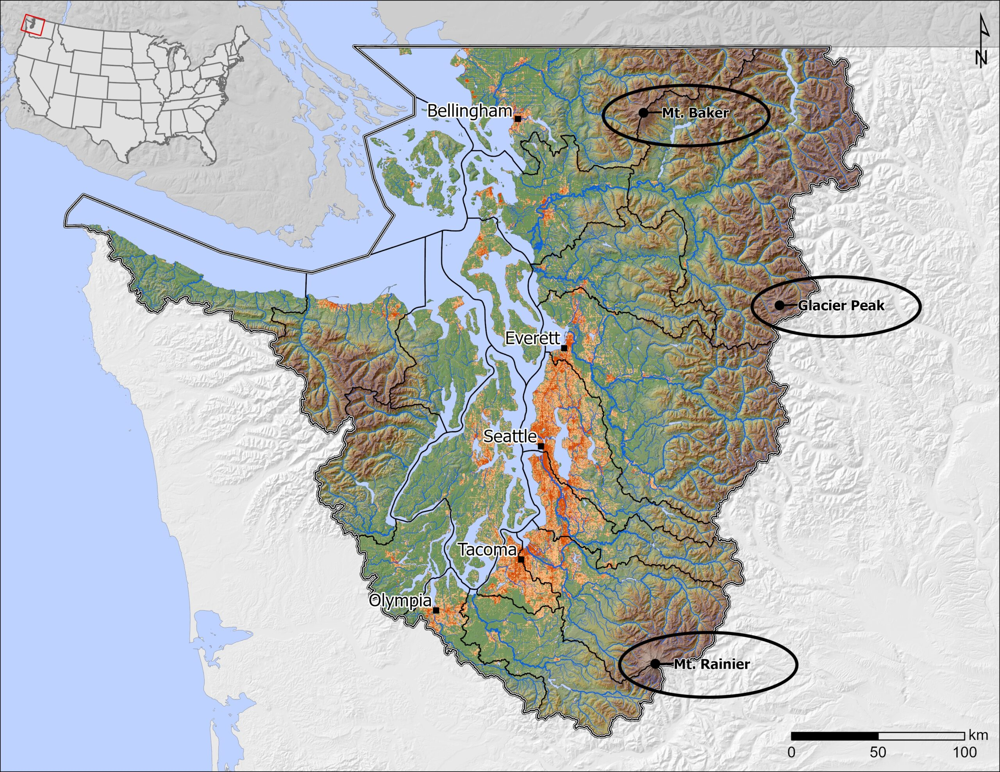
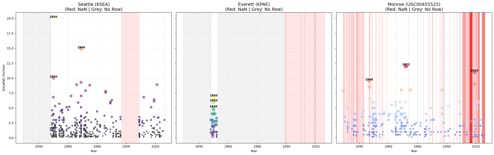

# ❄️ Puget Sound Snowfall Data Quality & Analysis (1948-Present)

## 📌 Project Overview
This project focuses on building a robust data processing pipeline to extract, clean, and evaluate long-term daily weather data from the **NOAA GHCND (Global Historical Climatology Network-Daily)** database. The primary objective is to analyze historical snowfall events across the **Puget Sound region**—specifically Seattle (KSEA), Everett (KPAE), and Monroe—while rigorously validating the integrity and quality of the underlying datasets.

*(Below: The Puget Sound region, a unique geographic area where complex coastal and mountainous terrains drive localized weather phenomena like the Puget Sound Convergence Zone.)*

## 🛠️ Key Engineering Features
* **Automated Data Pipeline:** Developed a Python pipeline using `Pandas` to fetch multi-decadal weather records, verify required columns, and perform accurate metric-to-standard unit conversions.
* **Advanced Data QA (Quality Assurance):** Implemented defensive programming logic to distinguish between missing observation values (`NaN`) and entirely missing row records (Data Gaps) within the time-series data.
* **Complex Visualization:** Designed a multi-layered visualization using `Matplotlib` and `Seaborn` to plot historical snowfall intensity while simultaneously mapping the timeline of data quality issues (highlighting missing periods).

## 📊 Data Quality & Snowfall Visualization

*(The chart below highlights major snowfall events. The red background indicates `NaN` values where the row exists but data is missing, and the grey background indicates completely missing daily records.)*

## 🚀 Future Work
* Integrate NCEP Reanalysis datasets to correlate the identified major PNW snowfall events with synoptic weather patterns.
* Quantify the mesoscale impact of the Puget Sound Convergence Zone (PSCZ) during extreme winter events.

## 💻 Tech Stack
* **Language:** Python
* **Libraries:** Pandas, NumPy, Matplotlib, Seaborn
* **Data Source:** NOAA GHCND
